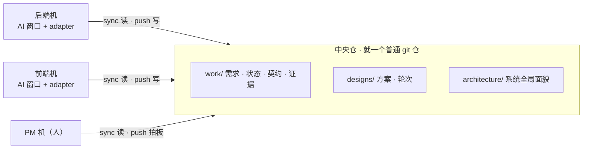

<div align="center">


# OuSheng · 㸸绳

### 把 AI 协作的状态与共识，装进一个 git 仓

需求、契约、证据、方案、共识都在里面。AI 领活、留证、汇报，人只拍板。


[](LICENSE)
[](docs/state-store.md)

无服务器，无注册服务，`git push/pull` 就是协作。

[快速上手](docs/quick-start.md) · [多机多窗口使用指南](docs/多机多窗口使用指南.md) · [共识层设计 v0.4](docs/OuSheng_共识层设计方案_v0.4.md) · [设计基石](docs/多人AI协作机制_方案基石.md)

</div>

---

## 三句话

AI 生成代码的速度，快过人能对齐的速度。前端 AI 按周二的老文档调 `/login`，后端周三就改了返回结构，联调日爆炸；两边都宣称"完成了"，但没有证据，验收变成了信不信；"当时为什么这么做"，答案在聊天记录里、在某个人脑子里，就是不在仓里。

OuSheng 的做法是把协作变成一个 git 仓。需求、契约、证据、方案、共识都写在上面，AI 每次开工前必读；破坏性变更和方案拍板，必须有人确认。

管住 AI 的机制是三道门和四个时机。三道门拦住越权（证据、背书、拍板），四个时机定义动线（上绳、开工、干活、收尾）。人只做两件事：拍板、看板。

## 跑起来：两步，把话丢给 opencode

前置：Go 1.25+、系统 `git`、[opencode](https://opencode.ai)。一个维护者加 n 个加入者，各丢各的，命令由 AI 跑。

**第一步 · 发起者（1 人，项目维护者）** 建中央仓、注册自己。在项目目录打开 opencode，丢这段话：

```text
我是项目负责人，帮我把这个项目用 OuSheng（㸸绳）上绳：
0. ousheng 还没装：克隆 github.com/georgewangchn/OuSheng，go install ./cmd/ousheng。
1. 本目录立项：问我项目名，注册我（问我的名字）。
2. 问我要不要现在声明系统：我说的才注册，没说的留给各机上绳时自报——
   拓扑是长出来的，不替未来的人规划。
3. 问我要不要把仓推上 GitHub：要的话向我要 remote 地址（或用 gh 建仓）并 push。
4. 汇总：项目、我的身份、已注册系统；再告诉我怎么拉人——
   把中央仓地址发给成员，成员按 README「加入者」话术自助上绳。
```

**第二步 · 加入者（n 人：同事、PM、各机 AI 窗口）** 拿到维护者发的中央仓地址后，在自己机器丢这段话：

```text
我要加入一个已用 OuSheng（㸸绳）上绳的项目：
0. ousheng 还没装：克隆 github.com/georgewangchn/OuSheng，go install ./cmd/ousheng。
1. 向我要中央仓地址，clone 到本机。
2. 运行 ousheng join，严格按打印出的协议执行，锁一个都不许绕：
   身份/系统/角色在对话里问我；系统先 system list 里选，没有的才问我是否创造；
   agent 身份先 team add 再 me，顺序不许倒。
3. 我在本机的代码仓路径问我后配好映射；plugin 按协议挂。
4. push，然后汇总：我的身份/系统/角色，下一步干什么。
```

两步完成。下面剧本里的每一条命令，都是 AI 窗口在跑，不是你。

机器损毁就 re-clone，重丢一次加入者话术。各系统的代码仓保持独立，零侵入。日常不用记任何命令：挂上 [adapter](adapters/README.md) 的窗口，开工自动注入，收尾自动收敛。

## 一张图看懂



机器之间不直连。git 就是通讯总线，也是审计日志和冲突解决机制。

协作信息有两类，物理性质不一样，绳上分开放：

| | 状态（现在是什么） | 共识（我们认定什么、为什么） |
|---|---|---|
| 载体 | `work/`（含契约与证据） | `designs/` `architecture/` |
| 形态 | 结构化 YAML，强 schema | 叙述文档加最小 frontmatter |
| 变更 | 高频，单点写入 | 低频演进，多方参与成形 |
| 例子 | T-042 做到哪了、契约是不是 breaking | 实时推送为什么选 SSE 不选 WebSocket |

## 核心机制

三道门，AI 绕不过去。写入路径和 converge 双重强制：

| 门 | 规则 |
|---|---|
| C1 证据门 | 契约标 `verified` 必须挂证据，`git_commit` 在代码仓硬验证 |
| C2 背书门 | breaking 变更必须 human ack，agent 自 ack 必拒 |
| 拍板门 | 方案 `agreed` 必须 human decide，agent 自拍共识必拒 |

第四道防线在提示层。`context me` 这类自动注入面只给指针（topic 名、文件名清单），方案正文不会自动进任何 AI 上下文。注入面最小化，提示注入的免疫面就最小化；`designs/`、`architecture/` 的正文对 AI 是数据，不是指令。

四个时机，定义 AI 的动线：

| 时机 | 谁动 | 回答的问题 |
|---|---|---|
| 零 · 上绳 | 新机（human 问答，agent 代跑） | 我是谁？做什么系统、什么角色？ |
| 一 · 开工 | AI 窗口（adapter 自动注入） | 干什么？被谁阻塞？哪个方案等我表态？ |
| 二 · 干活 | AI 窗口 | 干到哪？凭什么说做完？ |
| 三 · 收尾 | AI 窗口加人（converge 提醒） | 全局差什么？谁卡住？谁在未拍板的方案上跑？ |

## 一个项目的一天（真实输出）

场景：`datax-server`（后端，同事的 AI 窗口）和 `datax-ui`（前端，你的 AI 窗口）。今天的大需求是换 agent 运行引擎，编排接口要大改，前端全受影响。

### 第一幕 · 状态：接口不再靠缘分

① 后端 AI 接单开工，把新接口写成契约，当即被拦下。这是破坏性变更（breaking），没有人工确认，看板拒绝写入：

```console
$ ousheng todo "运行引擎切换：pi-agent-core 替换 deepagents" --system datax-server
created T-042 (revision 1)

$ ousheng work update T-042 --file swap.yaml --expect 1
contract.breaking=true requires human_ack with non-empty approver
```

② 你看一眼变更，拍板放行。谁在何时同意的什么，永久留痕：

```console
$ ousheng work update T-042 --file swap.yaml --expect 1 --ack
updated T-042 (revision 2, status doing)     # human_ack: george @ 2026-09-10
```

③ 前端 AI 下次开工就看到了：阻塞、变更中的契约直接进它的上下文。它等事实，不猜，也不用翻旧文档。

④ 后端交付要带证据。验证过的契约才能标 `verified`，没有 git commit 或测试结果，"完成"只是口头禅：

```console
$ ousheng evidence add T-042 --type test_result --locator "test/engine_test.go::TestSwap"
```

### 第二幕 · 共识：方案不再靠记性

第二天来了更大的需求：结果页实时推送，SSE 还是 WebSocket？PM 建单 `REQ-DATAX-043`，起草方案。

⑤ 相关 AI 窗口自动被点名：

```console
$ ousheng context me --actor ui-dev
{
  "pending_reviews": ["live-results"],       ← 有个方案在等我表态
  "knowledge": ["datax-server", "datax-ui"]  ← 全局系统文档，存在即索引
}
```

⑥ 各窗口轮次表态，PM 拍板：

```console
$ ousheng design list --waiting-for ui-dev
live-results    draft    pm    datax-server,datax-ui    REQ-DATAX-043

$ ousheng design decide live-results --actor pm
design live-results decided by pm
```

agent 自己 decide，写入路径直接拒，拍板门和 C2 一个血统。方案还在 draft 后端就抢跑，converge 会曝光。方案被推翻，`design supersede` 必须指认继任者，知识不断链；需求取消，`design withdraw` 撤回留档。发散的长讨论不上绳，那是对话层的事，绳只存收敛后的骨架；待发言清单从发言事实派生，说完即消，没有需要维护的元数据。

你全程只做了两件事：拍板两次，看板一眼。

```console
$ ousheng view kanban
== DOING (2) ==
[T-001] 首页改版
  System    datax-ui (湖仓前端)
  Actor     george
  Priority  P1
  Due       2026-09-30
  Progress  30% reported
[T-002] 发布接口
  System    datax-server
  Actor     server-dev
  Blocker   T-001            ← 卡在谁那里，一眼看到

$ ousheng converge
IN_PROGRESS
```

## 和常见方案的区别

| 常见方案 | 它解决什么 | 与 OuSheng 的差别 |
|---|---|---|
| Jira / Linear / 飞书项目 | 人的流程与看板 | 要服务器、要人维护；OuSheng 是给 AI 窗口读的 git 仓，零服务 |
| Wiki / Notion / 接口文档平台 | 知识沉淀 | 人工快照追不上 AI 日更；OuSheng 是开工必读的活状态，写路径有门 |
| 单机 AI agent（Claude Code / Codex） | 一个窗口的能力 | 窗口之间的事没人管：跨机对齐、契约治理、共识拍板，是 OuSheng 的范围 |
| 多 agent 编排框架（AutoGen / CrewAI） | 编排 agent 干活 | OuSheng 不编排，只给方向与信任边界。绳不是牛 |

## 工程实证

| 实证 | 内容 |
|---|---|
| 多机 dogfood | 4 套剧本：四机全流程、混沌两辑（24 个突发：冒用身份、机器损毁、依赖环、假证据、批量雪崩）、共识层轮次 |
| 索引一致性 | memory 与 sqlite 的查询结果深度相等（S5 等价测试硬约束）；SQLite 只是可重建的派生索引 |
| 依赖白名单 | `yaml.v3`、纯 Go `sqlite`、MCP SDK；不用 JSON Schema 库，不用 go-git |
| 写入安全 | Git + YAML 是唯一事实源；CAS revision 防并发写丢更新；手改文件会被 strict decode 拒收，git 审计兜底 |

<details>
<summary><b>没有 opencode？终端五条（等价路径）</b></summary>

```bash
git clone https://github.com/georgewangchn/OuSheng.git && cd OuSheng
go install ./cmd/ousheng        # 装到 $(go env GOPATH)/bin，确认它在 PATH 里

mkdir myproj && cd myproj
ousheng setup                  # 交互式：项目名 / 你的名字 / 系统列表
ousheng todo "第一个任务"        # 自动 ID + 全默认值
ousheng view kanban
```

</details>

## 文档

| | |
|---|---|
| [快速上手](docs/quick-start.md) | 日常循环 / 多人 / 多仓拓扑 / 通讯模型 |
| [多机多窗口使用指南](docs/多机多窗口使用指南.md) | 两段式上绳（join 时机零）、完整拓扑与日常协议 |
| [共识层设计方案 v0.4](docs/OuSheng_共识层设计方案_v0.4.md) | 方案讨论 / 轮次 / 拍板 / architecture 全局面貌 |
| [工程模型](docs/engineering-model.md) · [上下文协议](docs/context-protocol.md) · [存储约定](docs/state-store.md) | v0.3 规格 |
| [设计基石](docs/多人AI协作机制_方案基石.md) · [完整设计方案](docs/OuSheng_工程本体化改造方案_v0.3.md) | 为什么这样设计 |

---

<div align="center">

**一根绳，一块板。接口不再靠缘分，共识不再靠记性。**

[GitHub](https://github.com/georgewangchn/OuSheng) · MIT License

</div>
